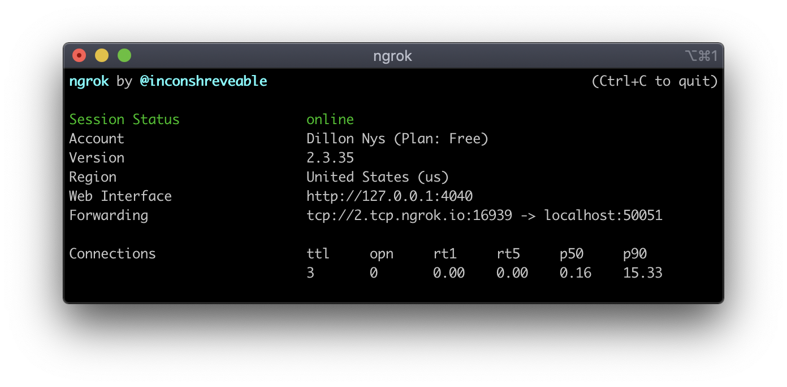

# gRPC Demo

Demonstration of the gRPC protocol with a Go server and a Flutter client.

## Why gRPC?

[gRPC](https://grpc.io) is an alternative to HTTP-JSON which sends structured binary data over [HTTP/2](https://developers.google.com/web/fundamentals/performance/http2/) instead of plaintext JSON, resulting in performance increases and more portable models. This is accomplished through the use of [Protocol Buffers](https://developers.google.com/protocol-buffers) for model development.


## Running the Demo
### Start Server

To start the server (requires [Go](https://golang.org) installation):

```
go run server/main.go
```

or, using Docker:

```
docker run -it -p 50051:50051 dillonnys/grpc-server:0.0.1
```

*And if running the Flutter Web client, also start the Envoy proxy (requires Docker):*

```
./start_proxy.sh
```

### Start Client

To start the client:

```
cd client && flutter run
```

## Running on a Device

In order to run the Flutter demo on a device (instead of a simulator), you must use [ngrok](https://ngrok.com) to tunnel the TCP traffic (requires a free ngrok account).

```
ngrok tcp 50051
```



After running this command, you'll need to copy the `Forwarding` address to [client/lib/core/config/config.dart](./client/lib/core/config/config.dart) (lines 13 and 24). For Flutter Web, the port is always `8080` because its traffic is routed through the Envoy proxy, explained below.

## Running on the Web

In order to use gRPC on the web, the [grpc-web](https://github.com/grpc/grpc-web) library is used. Currently, only unary and client-side streaming are supported. Moreover, an intermediate proxy is required to convert HTTP/2 requests and responses to HTTP/1 for the browser.

